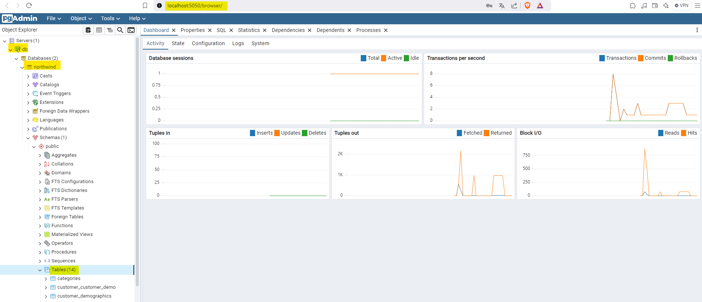

# Relatorio em SQL dos dados da base Northwind

### Objetivo do projeto
Este repositório tem como objetivo apresentar relatórios avançados construídos em SQL. As análises disponibilizadas aqui podem ser aplicadas em empresas de todos os tamanhos que desejam se tornar mais analíticas. Através destes relatórios, organizações poderão extrair insights valiosos de seus dados, ajudando na tomada de decisões estratégicas.

### Sobre o banco de dados Northwind
O banco de dados inclui 14 tabelas, contendo os dados de vendas de uma empresa chamada Northwind Traders, que importa e exporta alimentos especiais de todo o mundo.

O banco de dados Northwind é ERP com dados de clientes, pedidos, inventário, compras, fornecedores, remessas, funcionários e contabilidade.

O conjunto de dados Northwind inclui dados de amostra para o seguinte:

`Fornecedores`: Fornecedores e vendedores da Northwind

`Clientes`: Clientes que compram produtos da Northwind

`Funcionários`: Detalhes dos funcionários da Northwind 
Traders

`Produtos`: Informações do produto

`Transportadoras`: Os detalhes dos transportadores que enviam os produtos dos comerciantes para os clientes finais

`Pedidos e Detalhes do Pedido`: Transações de pedidos de vendas ocorrendo entre os clientes e a empresa

### Relacionamento entre as tabelas

# Configuração Inicial

## Manualmente
Utilize o arquivo SQL fornecido, nortwhind.sql, para popular o seu banco de dados.

## Com Docker e Docker Compose
Pré-requisito: Instale o [Docker Engine](https://docs.docker.com/engine/install/ubuntu/) no seu ambiente Linux.

### Começar com Docker
- Instalar Docker Compose

### Passos para configuração com Docker:
1. Iniciar o Docker Compose Execute o comando abaixo para subir os serviços:

~~~html
docker-compose up
~~~

2. Conectar o PgAdmin Acesse o PgAdmin pelo URL: http://localhost:5050, com a senha `postgres`.

~~~html
* **Aba General**:
    * Nome: db
* **Aba Connection**:
    * Nome do host: db
    * Nome de usuário: postgres
    * Senha: postgres Em seguida, selecione o banco de dados "northwind".
~~~

3. **Parar** o Docker Compose Pare o servidor iniciado pelo comando docker-compose up usando Ctrl-C e remova os contêineres com:
~~~html
docker-compose down
~~~

4. **Arquivos e Persistência**

Suas modificações nos bancos de dados Postgres serão persistidas no volume Docker `postgresql_data` e podem ser recuperadas reiniciando o Docker Compose com `docker-compose up`. Para deletar os dados do banco, execute:
 ~~~html
docker-compose down -v
 ~~~
